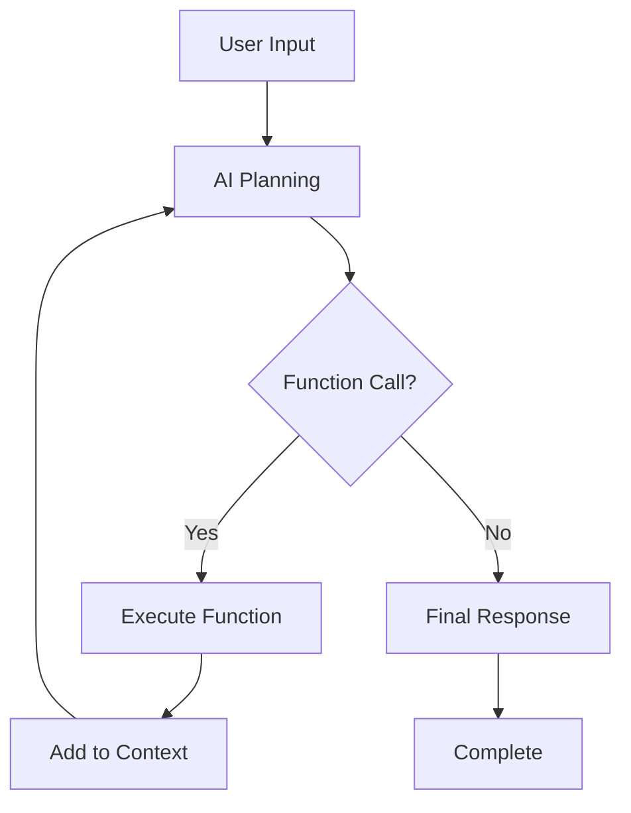

# 🤖 AI Coding Agent

[](https://python.org)
[](https://ai.google.dev/)
[](LICENSE)

A powerful AI-powered coding assistant that can autonomously interact with your filesystem, execute Python code, and help with development tasks. Built with Google's Gemini AI and designed for educational purposes following the Boot.dev AI Agent course.

## ✨ Features

### 🔧 Core Capabilities
- **File System Operations**: List directories, read file contents, and write files
- **Code Execution**: Run Python scripts with arguments and capture output
- **Intelligent Decision Making**: Uses function calling to choose appropriate tools
- **Conversation Memory**: Maintains context across multiple interactions
- **Security Constraints**: Sandboxed to a specific working directory

### 🎯 Function Library
| Function | Description | Security |
|----------|-------------|----------|
| `get_files_info` | Lists files and directories with size information | ✅ Working directory constrained |
| `get_file_content` | Reads and returns file contents (up to 10KB) | ✅ Working directory constrained |
| `write_file` | Creates or overwrites files with specified content | ✅ Working directory constrained |
| `run_python_file` | Executes Python scripts with optional arguments | ✅ 30-second timeout, working directory constrained |

### 🛡️ Security Features
- **Directory Sandboxing**: All operations restricted to specified working directory
- **Path Validation**: Prevents directory traversal attacks
- **Execution Timeout**: 30-second limit on Python script execution
- **Error Handling**: Comprehensive exception handling and user feedback

## 🚀 Quick Start

### Prerequisites
- Python 3.11 or higher
- Google AI API key (Gemini)
- UV package manager (recommended) or pip

### Installation

1. **Clone the repository**
   ```bash
   git clone https://github.com/its-michaelroy/Aiagent.git
   cd Aiagent
   ```

2. **Install dependencies**
   ```bash
   # Using UV (recommended)
   uv sync

   # Or using pip
   pip install -r requirements.txt
   ```

3. **Set up environment variables**
   ```bash
   cp .env.example .env
   # Edit .env and add your GEMINI_API_KEY
   ```

4. **Run the agent**
   ```bash
   # Using UV
   uv run main.py "list the files in the calculator directory"

   # Or using Python directly
   python main.py "explain how the calculator works"
   ```

## 📖 Usage

### Basic Commands

```bash
# List files and directories
python main.py "what files are in the root directory?"

# Read file contents
python main.py "show me the contents of main.py"

# Execute Python code
python main.py "run the calculator tests"

# Write files
python main.py "create a hello.py file that prints 'Hello, World!'"

# Complex multi-step tasks
python main.py "analyze the calculator code and fix any bugs you find"
```

### Command Line Options

```bash
python main.py "your prompt here" [--verbose]
```

- `--verbose`: Enable detailed output including token usage and function call details

### Example Interactions

**File Analysis:**
```bash
$ python main.py "explain how the calculator renders results to the console"
 - Calling function: get_files_info
 - Calling function: get_file_content
 - Calling function: get_files_info
 - Calling function: get_file_content
Final response:
The calculator renders results using the render() function in pkg/render.py...
```

**Code Execution:**
```bash
$ python main.py "run the calculator with the expression '2 + 2'"
 - Calling function: run_python_file
Final response:
┌─────────────────┐
│ 2 + 2           │
│ =               │
│ 4               │
└─────────────────┘
```

## 🏗️ Architecture

### Project Structure
```
Aiagent/
├── main.py                 # Main application entry point
├── config.py              # Configuration constants
├── functions/             # Function library
│   ├── get_files_info.py     # Directory listing functionality
│   ├── get_file_content.py   # File reading functionality
│   ├── write_file_content.py # File writing functionality
│   └── run_python.py         # Python execution functionality
├── calculator/            # Example working directory
│   ├── main.py               # Calculator application
│   ├── tests.py              # Calculator tests
│   └── pkg/
│       ├── calculator.py     # Calculator logic
│       └── render.py         # Result rendering
├── tests.py              # Agent functionality tests
└── pyproject.toml        # Project configuration
```

### Agent Loop Architecture

The AI agent operates using a sophisticated feedback loop:

1. **User Input**: Natural language request
2. **Function Planning**: AI decides which functions to call
3. **Function Execution**: Secure execution of chosen functions
4. **Result Integration**: Function results added to conversation context
5. **Iteration**: Process repeats until task completion (max 20 iterations)



### Function Calling System

Each function includes:
- **Implementation**: The actual Python function
- **Schema Declaration**: Formal specification for the AI
- **Security Validation**: Input sanitization and path checking
- **Error Handling**: Comprehensive exception management

## 🧪 Testing

Run the included test suite:

```bash
python tests.py
```

This will test:
- File writing operations
- Python code execution
- Security boundary enforcement
- Error handling

## ⚙️ Configuration

### Environment Variables

Create a `.env` file in the project root:

```env
GEMINI_API_KEY=your_api_key_here
```

### Configuration Options

Edit `config.py` to modify:
- `MAX_CHARS`: Maximum characters to read from files (default: 10,000)

## 🔒 Security Considerations

### ⚠️ Important Security Notes

This AI agent is designed for **educational purposes only** and includes several security features, but also has inherent risks:

**Security Features:**
- ✅ Working directory sandboxing
- ✅ Path traversal prevention
- ✅ Execution timeouts
- ✅ Input validation

**Security Limitations:**
- ⚠️ Can execute arbitrary Python code within the working directory
- ⚠️ No advanced process isolation
- ⚠️ Limited resource usage controls

**Recommendations:**
- Only use in controlled, non-production environments
- Never run on systems with sensitive data
- Always review generated code before execution
- Consider running in a containerized environment

## 🤝 Contributing

1. Fork the repository
2. Create a feature branch: `git checkout -b feature/amazing-feature`
3. Commit changes: `git commit -m 'Add amazing feature'`
4. Push to branch: `git push origin feature/amazing-feature`
5. Open a Pull Request

### Development Setup

```bash
# Clone your fork
git clone https://github.com/YOUR_USERNAME/Aiagent.git
cd Aiagent

# Install development dependencies
uv sync --dev

# Run tests
python tests.py
```

## 📚 Learning Resources

This project was built following the [Boot.dev AI Agent Course](https://boot.dev). Key concepts covered:

- **Function Calling**: How AI models can use external tools
- **Agent Architecture**: Building autonomous AI systems
- **Security in AI**: Sandboxing and safety considerations
- **Conversation Management**: Maintaining context across interactions

## 🐛 Troubleshooting

### Common Issues

**"No GEMINI_API_KEY found"**
- Ensure your `.env` file contains a valid API key
- Check that the `.env` file is in the project root

**"Cannot execute outside working directory"**
- This is expected behavior - the agent is security-constrained
- Ensure file paths are relative to the working directory

**"Maximum iterations reached"**
- The agent may be stuck in a loop
- Try rephrasing your request or being more specific

### Debug Mode

Use `--verbose` flag for detailed debugging information:

```bash
python main.py "your request" --verbose
```

## 📄 License

This project is licensed under the MIT License - see the [LICENSE](LICENSE) file for details.

## 🙏 Acknowledgments

- [Boot.dev](https://boot.dev) for the excellent AI Agent course
- [Google AI](https://ai.google.dev/) for the Gemini API
- The Python community for excellent tooling and libraries

## 📞 Support

For questions, issues, or contributions:

- 📧 Open an issue on GitHub
- 💬 Join the Boot.dev Discord community
- 📖 Check the troubleshooting section above

---

**⚠️ Educational Use Only**: This AI agent is designed for learning purposes. Do not use in production environments without additional security measures.
